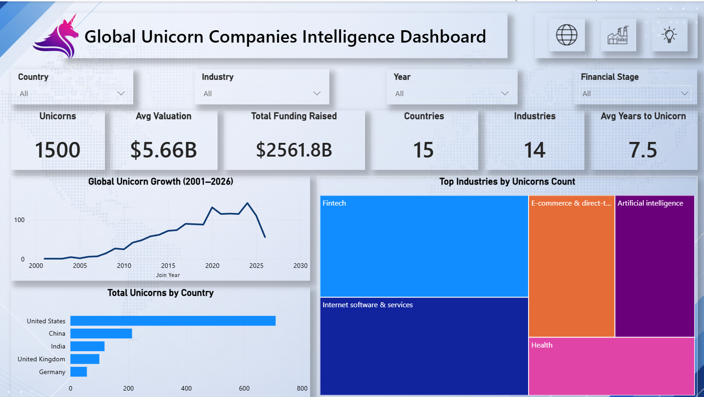
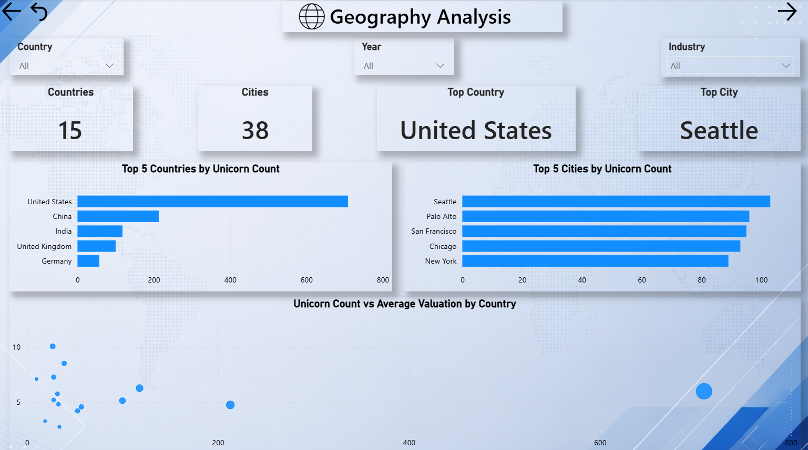
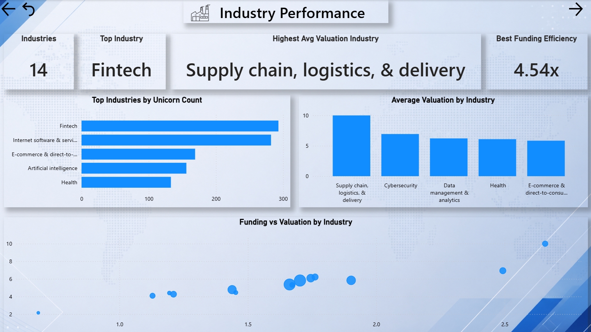
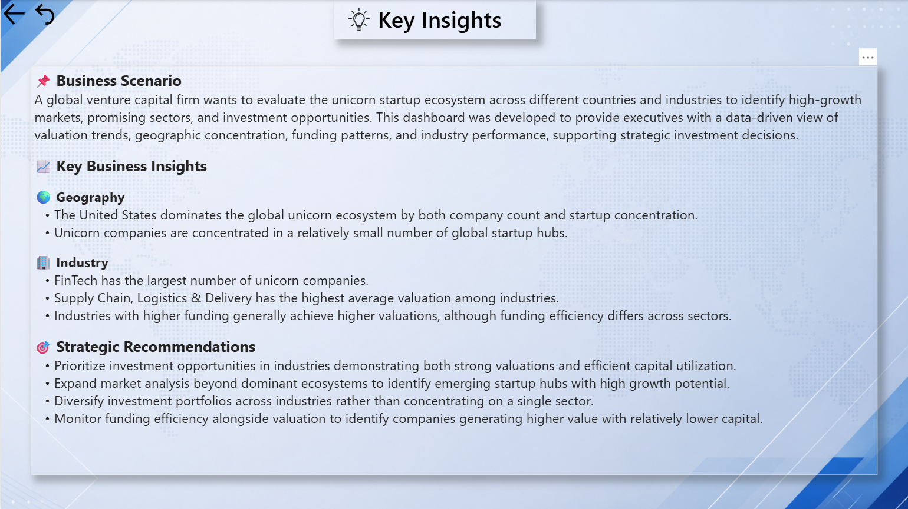

# 🌎 Global Unicorn Companies Analysis

### Power BI | Data Analytics | Business Intelligence

## 📌 Overview

An interactive Power BI dashboard analyzing **1,500 global unicorn companies** to understand valuation, funding, industry performance, geographic concentration, and unicorn growth over time.

The project is framed as an **investment intelligence analysis** for a venture capital team evaluating the global startup ecosystem.

---

## 🎯 Business Problem

A venture capital team needs a clear view of the global unicorn ecosystem to understand:

- Where are unicorn companies concentrated?
- Which industries have the highest number of unicorns?
- Which industries have higher average valuations?
- How does funding compare with valuation?
- Which countries and cities act as major startup hubs?

The goal was to transform company-level data into an interactive executive dashboard that supports further business analysis.

---

## 📊 Dataset

The dataset contains **1,500 unicorn companies** across:

- 15 countries
- 38 cities
- 14 industries

Key fields include:

- Company
- Valuation
- Date Joined
- Country
- City
- Industry
- Investors
- Founded Year
- Total Raised
- Financial Stage

---

## 🔍 Key Metrics

| Metric | Result |
|---|---:|
| Unicorn Companies | 1,500 |
| Average Valuation | $5.66B |
| Total Funding Raised | $2,561.8B |
| Countries | 15 |
| Industries | 14 |
| Average Years to Unicorn | 7.5 |

---

## 📈 Dashboard

### 1. Executive Overview

Provides a high-level view of unicorn growth, valuation, funding, country distribution, and industry distribution.

### 2. Geography Analysis

Analyzes country and city concentration and compares unicorn count with average valuation.

### 3. Industry Performance

Compares industries by unicorn count, average valuation, funding, and funding efficiency.

### 4. Key Insights

Summarizes the major observations from the analysis and translates them into business considerations.

---

## 💡 Key Findings

- The **United States** has the highest number of unicorn companies in the dataset, with **709 companies**.
- **Seattle** is the leading city by unicorn count, with **103 companies**.
- **FinTech** is the largest industry, with **293 companies**.
- The overall average company valuation is approximately **$5.66B**.
- **Supply Chain, Logistics & Delivery** has the highest average valuation among industries at approximately **$10B**.
- The highest average funding-efficiency result is approximately **4.54×** for Supply Chain, Logistics & Delivery.

> Funding efficiency is calculated as Valuation ÷ Total Raised and is used only as a comparative analytical metric.

---

## 🛠️ Tools Used

- Power BI
- DAX
- Excel / CSV
- Data Analysis
- Data Visualization

---

## 📌 Business Value

The dashboard provides stakeholders with a consolidated view of:

**Growth → Geography → Industry → Valuation → Funding**

This helps analysts identify patterns and areas that require deeper investigation when evaluating startup ecosystems.

---

## 👨‍💻 Author

**Niraj Pawar**

Data Analyst | Business Intelligence | Data Science
